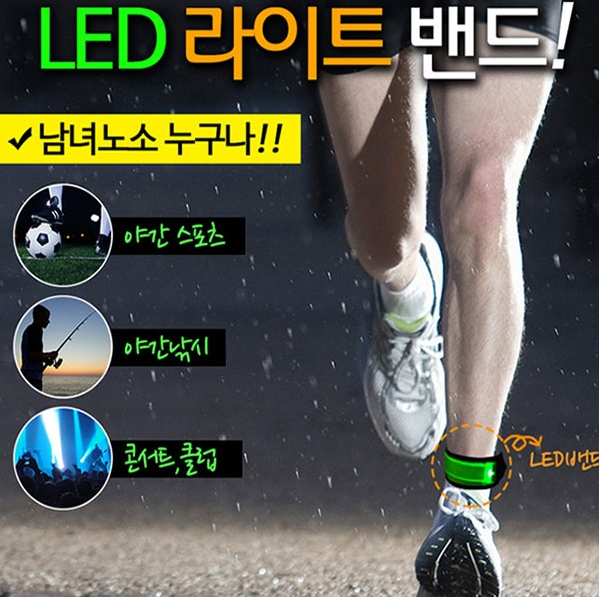

# JB04
<!DOCTYPE html>
<html>
<head>
	<meta charset="utf-8">
	<title>만원의 행복</title><meta charset="utf-8">
	<link href="https://fonts.googleapis.com/css?family=Noto+Sans+KR" rel="stylesheet">
	<link href="https://fonts.googleapis.com/css?family=Black+Han+Sans" rel="stylesheet">
    
</head>
<body>
	<nav>
		<ul>
		<li><a href="http://itempage3.auction.co.kr/DetailView.aspx?ItemNo=B311348380&frm3=V2">LED LIGHT BAND</a></li>
		<li><a href="http://www.11st.co.kr/product/SellerProductDetail.tmall?method=getSellerProductDetail&prdNo=1346832712&NaPm=ct=jtpf42g0|ci=8764b7b8f083f5532214c5f7006ad57a2be3b2ff|tr=ligh|sn=17703|hk=df89c6f815359370b88389227e17f0b8f6bc2c90&utm_term=&utm_campaign=%B3%D7%C0%CC%B9%F6pc_%B0%A1%B0%DD%BA%F1%B1%B3%B1%E2%BA%BB&utm_source=%B3%D7%C0%CC%B9%F6_PC_PCS&utm_medium=%B0%A1%B0%DD%BA%F1%B1%B3">LED SHOE CLIP LIGHT</a></li>
		<li><a href="https://smartstore.naver.com/ubcar/products/2682945651">WHEEL LIGHT</a></li>
	    </ul>
	</nav>

    <h1>어두운 밤을 밝히는 LED LIGHT </h1>

<section>
	<h2>LED LIGHT BAND</h2>
	</section>
  <section>
      
      
      
팔뚝, 손목, 발목, 배낭 등 여러 곳에 사용할 수 있으며 야간에 아주 잘 보입니다
 
      
옵션 ㅣ 화이트 / 그린 / 블루 / 옐로우 / 오렌지

      </section>
<section>  
    <h2>LED SHOE CLIP LIGHT</h2>
    </section>
  <section>
	  
      
      
      
조깅, 하이킹, 등산, 밤과 안개 짙은 날에도 안심하고 즐기세요!

      
야간의 어떤 위험에서 안전하게 위치를 알 수있습니다
 
      
옵션 ㅣ 블랙 / 화이트

      </section>      
<section> 
    <h2>WHEEL LIGHT</h2>
     
내 자전거를 화려하게 장식하고 야간 라이딩시 내 안전을 위해!

    </section>
  <section> 
      
WING TYPE WHEEL LIGHT

      
      </section>
  <section> 
      
CAP TYPE WHEEL LIGHT

      
      </section>

	 	 
<section>	
    <h3>가격 구성</h3>
    <ul>
      <li>LED LIGHT BAND - 2000원</li>
      <li>LED SHOE CLIP LIGHT - 2500원</li>
	  <li>WING TYPE WHEEL LIGHT - 1200원</li>
	  <li>CAP TYPE WHEEL LIGHT - 1200원</li>
	  </ul>
    </section>
<section>
	<h3>차별점 및 구매 포인트</h3>
	 
어두운 밤에 운동하는 사람들을 위해 기획된 LED LIGHT
	 자전거 타는 사람 따로 조깅히는 사람 따로 사야 되는 기존의 제품과는 다르게  
	 조깅하는 사람부터 인라인 스케이트, 자전거 타는 사람까지 모두 이용할 수 있는 제품 
	안전과 함께 비주얼적으로도 소비자를 만족 시킬 수 있는 패키지 상품

	</section>

	<h4>copyright© 2019 한경대학교 디자인학과 이재범</h4>

</body>
</html>>
